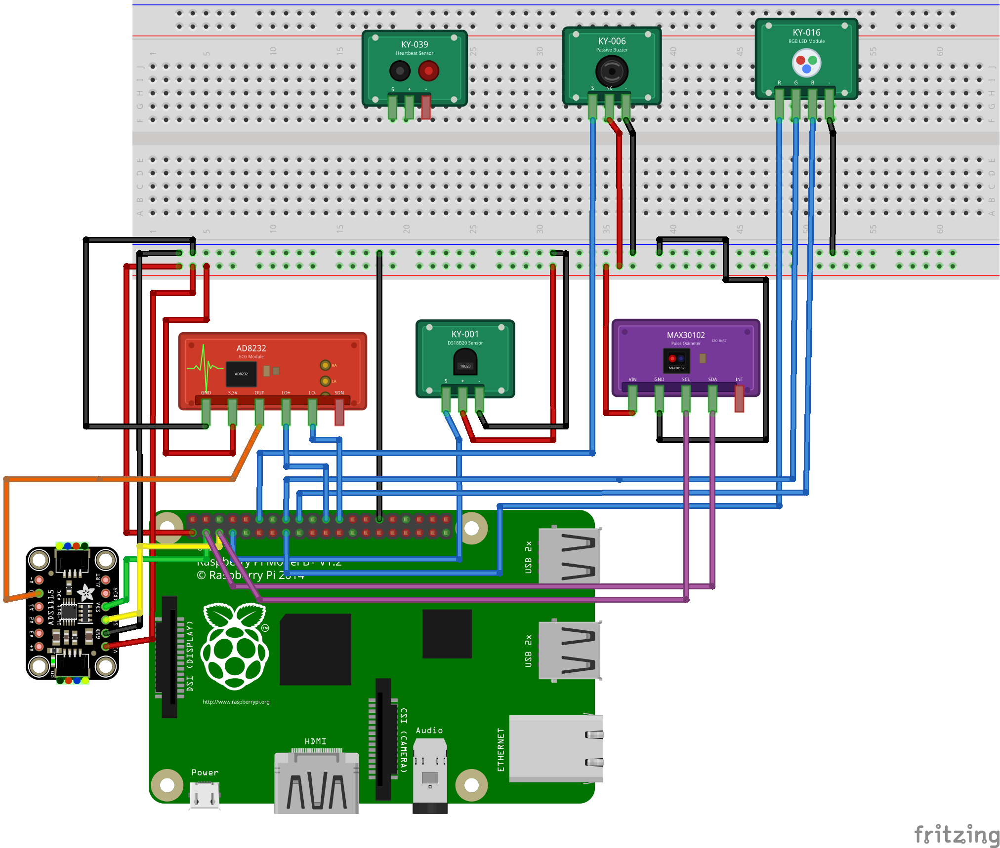

## Hardware
 Component | Module / Model | Purpose |
|---|---|---|
| Raspberry Pi 5 | Raspberry Pi 5 | Runs sensor-reading scripts, processes signals, controls feedback outputs, etc |
| Pulse oximeter sensor | MAX30102 | Measures optical pulse signal and estimates heart rate / SpO₂ via I²C |
| ECG module | AD8232 | Measures electrical heart activity and outputs analog ECG signal |
| Heartbeat sensor | KY-039 | Detects pulse changes in light transmission via fingertip or any tip |
| Temperature and humidity sensor | KY-015 / DHT11 | Measures temperature and humidity |
| Digital temperature sensor | KY-001 / DS18B20 | Measures temperature using digital 1-Wire interface |
| 3-color RGB LED | KY-016 | Color-based status |
| Passive buzzer | KY-006 | Pulse tones |
| ADC module | ADS1115 | Converts KY-039 analog signal into digital | 

## Initial Fritzing breadboard diagram for the prototype:

---